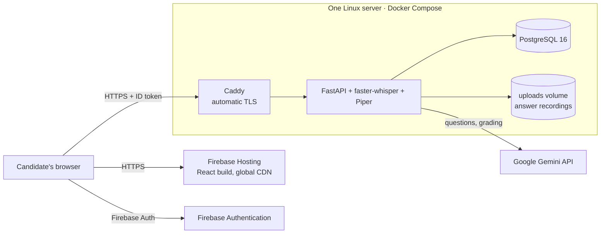

# Deployment Plan

How and where to run the AI Interview Evaluation System in production. Status: **ready to deploy, not deployed yet.**

## Release scope

### Version 1 (this release)
- Adaptive Standard interview, spoken end to end: Piper reads every question, the candidate answers out loud (typed mode for accessibility), faster-whisper transcribes, Gemini grades each answer silently on four criteria, and one holistic review writes the final summary.
- Whole-interview recording with chunked upload, resume after reload, and playback in the report.
- Proctoring: fullscreen enforcement, detection of leaving the interview (tab, window or app), blocked copy/paste/right-click and inspection shortcuts, second-display check, camera signals (extra faces, out of frame); automatic end after the configured number of violations; integrity section in the report.
- Interview Arena, history, reports, profile, Firebase sign-in with server-side token checks.

### Version 2 (planned): coding round with VPL
- A coding round of programming questions in the interview, built on **VPL (Virtual Programming Lab)**: an in-browser code editor plus sandboxed compilation, execution and automatic test-case grading (the VPL Jail server).
- Integration plan: generate coding tasks and hidden test cases from the role and job description; run submissions in the isolated VPL execution server, never on the API server; combine test results with the AI review of code quality into the report.
- Stronger lockdown for the coding round: VPL works with **Safe Exam Browser**, which can block other applications at the operating-system level (beyond what a web page can detect).

## 1. Recommended setup



| Part | Where | Why |
| --- | --- | --- |
| Frontend (React build) | **Firebase Hosting** | Same Firebase project the app already uses for login; free tier, CDN, HTTPS, and the `*.web.app` domain is already an authorised sign-in domain |
| Backend API | **One Linux VM** with Docker Compose | faster-whisper needs about 1–2 GB RAM and steady CPU; recordings need a persistent disk |
| Database | **PostgreSQL 16 container** on the same VM | Matches the schema and transactions the app is built on; not exposed to the internet |
| Recordings | Docker volume on the VM, uploaded in 10-second chunks during the interview and served only to the owner | Private by design; no extra storage service |
| Speech | faster-whisper (speech-to-text) and Piper (spoken questions), both baked into the image | No per-minute fees; audio never leaves the server |
| HTTPS for the API | **Caddy** container | Gets and renews Let's Encrypt certificates automatically |

### Why not a free serverless tier
Free tiers (Render free, Railway trial, Cloud Run with defaults) either sleep, cap memory around 512 MB, or have no persistent disk. Whisper would be killed for memory or reload on every cold start, and recordings would vanish on restart. One small VM avoids all three problems and is easy to explain in a viva.

## 2. Where: choosing the server

Any provider works; the stack only needs **Ubuntu 24.04, 2 vCPU, 4 GB RAM, 40 GB disk**.

| Provider | Suitable size | Notes |
| --- | --- | --- |
| DigitalOcean | Basic Droplet 2 vCPU / 4 GB | Simplest console. The GitHub Student Developer Pack has historically included DigitalOcean credit |
| Microsoft Azure | B2s (2 vCPU / 4 GB) | "Azure for Students" credit usually needs no credit card |
| AWS Lightsail | 4 GB instance | Fixed monthly price, simple firewall |
| Google Cloud | e2-medium | Same Google account as Firebase; new-account trial credit |

Typical cost for this size is roughly US$20–30 per month; check current pricing and student credits before choosing. **Recommendation: DigitalOcean or Azure for Students**, whichever credit you can claim.

**Domain:** a subdomain such as `api.yourdomain.com` is best. Without a domain, use the free wildcard DNS service sslip.io: `API_DOMAIN=<server-ip>.sslip.io` gets a valid certificate with no DNS setup.

## 3. Step by step

### A. Prepare the server (once)
```bash
# On the new Ubuntu server, as a sudo user
sudo apt update && sudo apt upgrade -y
curl -fsSL https://get.docker.com | sudo sh
sudo usermod -aG docker $USER        # log out and back in afterwards
sudo ufw allow OpenSSH && sudo ufw allow 80 && sudo ufw allow 443 && sudo ufw enable
```

### B. Point DNS at the server
Create an **A record** `api.yourdomain.com → <server IP>` (skip this when using sslip.io).

### C. Deploy the backend
```bash
git clone https://github.com/GaneshKotakonda/ai-interview-evaluation-sysytem.git
cd ai-interview-evaluation-sysytem/deploy
cp .env.example .env
nano .env        # API_DOMAIN, CORS_ORIGINS, POSTGRES_PASSWORD, GEMINI_API_KEY
chmod 600 .env
docker compose up -d --build
docker compose logs -f api    # wait for "Application startup complete"
```
On first start PostgreSQL applies `schema.sql` automatically and Caddy fetches the HTTPS certificate.

Check it: open `https://<API_DOMAIN>/api/health`. Expect `"database": true`, `"gemini_configured": true`, `"speech_to_text": {"loaded": true}` and `"text_to_speech": {"loaded": true}`.

### D. Deploy the frontend to Firebase Hosting
On your own computer, from the repository root:
```bash
npm install -g firebase-tools
firebase login
```
Create `.env.production` (not committed) with the API address:
```env
VITE_API_BASE_URL=https://api.yourdomain.com
```
Then build and deploy (the project is preset in `.firebaserc`):
```bash
npm ci
npm run build
firebase deploy --only hosting
```
The site is served at `https://ai-evaluation-40c8a.web.app`. `firebase.json` already handles SPA routing, asset caching, and allows camera and microphone access.

### E. Firebase Authentication settings
Firebase console → Authentication → Settings → **Authorised domains**: `ai-evaluation-40c8a.web.app` is there by default. Add any custom frontend domain you use. Make sure that domain is also in `CORS_ORIGINS` in `deploy/.env`.

### F. Smoke test (about 10 minutes)
1. Sign up, then sign in on the deployed site.
2. Readiness: the mic meter moves, **Test speakers** plays the interviewer voice, consent and continue.
3. Run a Standard interview by voice: each question is spoken, answers end with **Next Question** or a pause, and the interview finishes with the closing message.
4. Proctoring: during an interview press Alt+Tab (or switch tab) and confirm the "You left the interview" warning, then return; in a second interview repeat until the limit ends it.
5. Open the report: criteria, delivery, camera summary, **Integrity** section, and the interview recording with "Play this answer".
6. Reload the page in the middle of an interview: it resumes.
7. Play an Arena session to the Boss Round.
8. `docker compose logs api` shows no errors.

## 4. Updating
```bash
cd ai-interview-evaluation-sysytem && git pull
cd deploy && docker compose up -d --build api
# Apply schema changes (schema.sql is additive and safe to re-run):
docker compose exec -T db sh -c 'psql -v ON_ERROR_STOP=1 -U "$POSTGRES_USER" -d "$POSTGRES_DB"' < ../schema.sql
```
Frontend: `npm run build && firebase deploy --only hosting`.

## 5. Backups and retention
**Database, nightly.** Add this cron job on the server (`crontab -e`). Keep about 14 days of dumps, copy them off the server weekly, or enable the provider's volume snapshots.
```bash
0 2 * * * cd ~/ai-interview-evaluation-sysytem/deploy && docker compose exec -T db sh -c 'pg_dump -U "$POSTGRES_USER" "$POSTGRES_DB"' | gzip > ~/backups/db-$(date +\%F).sql.gz
```

**Recordings.** They live in the `uploads` volume and are deleted when a user deletes an interview. To cap disk use, delete recordings older than N days:
```bash
docker compose exec api find backend/uploads -type f -mtime +60 -delete
```

## 6. Monitoring
- `docker compose ps` should show all services `healthy` or `running`. The API container has a health check against `/api/health`.
- Logs: `docker compose logs --since 1h api`.
- Add a free uptime monitor (for example UptimeRobot) on `https://<API_DOMAIN>/api/health`.

## 7. Security checklist
- [ ] `deploy/.env` has `chmod 600`, is never committed, and uses a long random `POSTGRES_PASSWORD`.
- [ ] Firewall allows only 22, 80 and 443; PostgreSQL has no published port.
- [ ] SSH uses keys only (`PasswordAuthentication no`).
- [ ] `CORS_ORIGINS` lists only the real frontend origins.
- [ ] Every API call is authenticated with Firebase ID tokens (already enforced) and recordings are owner-only (already enforced).
- [ ] Restrict the Gemini API key in Google Cloud to the Generative Language API.
- [ ] `sudo apt upgrade` monthly; `docker compose pull && docker compose up -d` for base images.

## 8. Sizing

| Load | Server | `STT_MODEL` |
| --- | --- | --- |
| Demo or class (a few users at a time) | 2 vCPU / 4 GB | `base.en` |
| Better transcript accuracy | 4 vCPU / 8 GB | `small.en` |
| Many concurrent users | Add a GPU host or set `STT_PROVIDER=gemini` | — |

Transcription runs one answer at a time per server (by design). On 2 vCPUs, `base.en` handles a one-minute answer in a few seconds, and Piper speaks a question in well under a second (cached afterwards). A 10-minute interview recording is roughly 75 MB at the default bitrate; plan disk space accordingly.

**Licences:** faster-whisper is MIT. Piper is GPL-3.0: running it as part of a hosted service is fine; only redistributing modified Piper code would require publishing that code.

## 9. Managed alternative (no server administration)
- **API:** Render "Web Service" from `deploy/Dockerfile` on a 2 GB plan, with a persistent disk mounted at `/app/backend/uploads`.
- **Database:** Neon or Render PostgreSQL. Run `schema.sql` once with `psql "$DATABASE_URL" -f schema.sql`.
- **Frontend:** Firebase Hosting, as above.

This costs more per month than one VM but involves no Linux administration. Set the same environment variables as `deploy/.env.example` in the provider's dashboard.

## 10. Continuous integration
`.github/workflows/ci.yml` runs both test suites and the production build on every push and pull request, so a broken change is caught before it is deployed.
